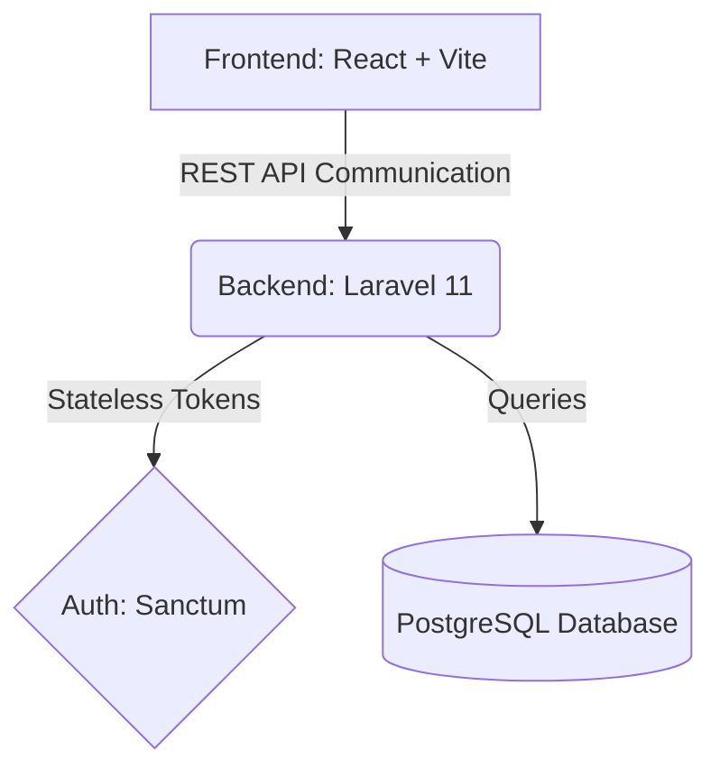

<div align="center">
  
# 🚀 PulseDesk
**A modern, production-ready, multi-tenant Helpdesk and Ticketing SaaS platform.**

[](#)
[](#)
[](#)
[](#)
[](#)
[](#)

*Built for the NMG Forge2 Hackathon by Shivansh Jaiswal*

</div>

---

## 🎯 Problem Statement
> Many organizations struggle with fragmented customer support systems that lack proper tenant isolation, SLA enforcement, and centralized communication. **PulseDesk addresses these challenges** by providing a scalable SaaS helpdesk solution where multiple organizations can securely operate within isolated workspaces while maintaining efficient support workflows.

---

## 🔗 Live Demo
| 🌐 Service | 🔗 Link |
| --- | --- |
| **Frontend (Vercel)** | [https://forge2-shivansh.vercel.app](https://forge2-shivansh.vercel.app) |
| **Backend API (Render)** | [https://pulsedesk-api-nnjd.onrender.com](https://pulsedesk-api-nnjd.onrender.com) |

---

## ✨ Key Features

### 🔐 Multi-Tenancy
* **Complete Tenant Isolation:** Secure architecture using Organizations.
* **Strict Scoping:** Users can only access resources belonging to their organization.
* **Security:** Prevents unauthorized cross-organization access at the database query level.

### 👥 Role-Based Access Control (RBAC)
| Role | Permissions |
| :--- | :--- |
| 🧑‍💻 **Customer** | Create and view personal tickets. |
| 🎧 **Agent** | Manage assigned tickets, update statuses, and communicate with customers. |
| 👑 **Admin** | Full organizational control. Manage tickets, users, and assignments. |

### ⏱️ Automated SLA Monitoring
* Dynamic SLA policies per organization.
* Automatic breach detection algorithms.
* Dashboard indicators and red highlights for breached tickets.
* Priority-based resolution thresholds.

### 💬 Advanced Conversation System
* Public customer replies for direct support.
* Internal team notes (hidden from customers) for collaborative workflows.

### 📜 Activity Timeline & Audit Trail
Tracks every critical action:
* Ticket creation & Status changes
* Priority updates & Reassignments
* Administrative actions

### 🎨 Modern UI/UX
* Clean, responsive, glassmorphic interface.
* Built using React and TailwindCSS.
* Optimized for both desktop and mobile viewports.

---

## 🏗️ Architecture



---

## 🛠️ Technology Stack

| Domain | Technologies |
| :--- | :--- |
| **Frontend** | React 19, Vite, TailwindCSS, React Query (TanStack), Axios, React Router DOM, Lucide Icons |
| **Backend** | Laravel 11/12, PHP 8.4, RESTful API Architecture |
| **Database** | PostgreSQL (Production), MySQL (CI Testing), SQLite (Local Dev) |
| **Authentication**| Laravel Sanctum (Token-Based) |
| **Infrastructure**| Docker, Render, Vercel |
| **CI/CD** | GitHub Actions, PHPUnit |

---

## 🗄️ Database Design

* **Organizations:** Root entity of the multi-tenant architecture.
* **Users:** Belongs to Organization. Roles: Admin, Agent, Customer.
* **Tickets:** Contains Subject, Description, Status, Priority, Assignee, Requester.
* **Ticket Conversations:** Stores Public replies and Internal notes.
* **Activity Logs:** Maintains complete audit history.
* **SLA Policies:** Defines response and resolution thresholds.

---

## 🧪 Automated Testing
The platform includes an extensive automated test suite covering:
* Authentication edge cases (Duplicate registrations, invalid logins)
* Authorization checks & Role restrictions
* Multi-tenancy isolation (Cross-tenant access prevention)
* SLA breach calculations (Time-travel simulations using `Carbon`)
* Dashboard metrics

**Run tests locally:**
```bash
cd backend
php artisan test
```

---

## ⚙️ CI/CD Pipeline
GitHub Actions automatically executes on every push. Pipeline tasks include:
1. Provision MySQL container.
2. Install dependencies.
3. Generate Laravel `APP_KEY`.
4. Run database migrations.
5. Execute PHPUnit suite.
6. Validate build success.

---

## 🚀 Deployment
* **Frontend:** Hosted on Vercel with SPA fallback routing.
* **Backend:** Hosted on Render via a custom `Dockerfile` blueprint.
* **Database:** Managed PostgreSQL instance on Render.

---

## 🚦 Local Setup

### Backend
```bash
cd backend
composer install
cp .env.example .env
php artisan key:generate
php artisan migrate --seed
php artisan serve
```

### Frontend
```bash
cd frontend
npm install
npm run dev
```

---

## 📸 Screenshots

<details>
<summary><b>Click to expand and view all screenshots</b></summary>
<br>


</details>

---

## 🚧 Challenges Faced
* Designing strict multi-tenant isolation.
* Implementing secure role-based authorization.
* Handling SPA routing in Vercel.
* Deploying Laravel with Docker on Render.
* Building reliable SLA breach detection.

---

## 🔮 Future Scope
* Email notifications.
* WebSocket real-time updates.
* File attachments.
* Analytics dashboard.
* AI-powered ticket classification.
* Automatic ticket assignment.
* Knowledge base integration.
